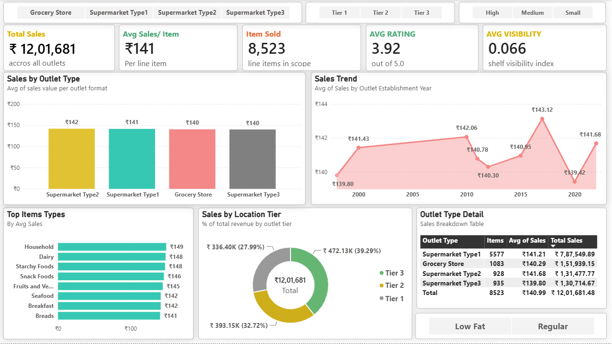

# 🧾 E-Commerce Sales Data — Data Analysis

_Analyze E-Commerce Store sales performance , distributions of Sales, Item Weight, Item Visibility, Rating and support to decision-making using Power BI ,Python , SQL._

---

## 📌 Table of Contents
- <a href="#overview">Overview</a>
- <a href="#business-problem">Business Problem</a>
- <a href="#dataset">Dataset</a>
- <a href="#tools--technologies">Tools & Technologies</a>
- <a href="#project-structure">Project Structure</a>

- <a href="#exploratory-data-analysis-eda">Exploratory Data Analysis (EDA)</a>
- <a href="#research-questions--key-findings">Research Questions & Key Findings</a>
- <a href="#dashboard">Dashboard</a>
- <a href="#how-to-run-this-project">How to Run This Project</a>
- <a href="#final-recommendations">Final Recommendations</a>
- <a href="#author--contact">Author & Contact</a>

---
<h2><a class="anchor" id="overview"></a>Overview</h2>

This project analyzes E-commerce sales data to identify key factors influencing revenue across outlets, items, and categories. It combines exploratory data analysis with an interactive dashboard to turn raw sales data into actionable business insights. 
---
<h2><a class="anchor" id="business-problem"></a>Business Problem</h2>

E-commerce store operates across multiple outlet types, sizes, and location tiers, but sales performance varies significantly between them, and it's unclear which factors — outlet format, item category, or product attributes — drive the biggest differences in revenue. This lack of visibility makes it difficult for business teams to prioritize inventory, allocate resources, and identify underperforming outlets or item categories.

---
<h2><a class="anchor" id="dataset"></a>Dataset</h2>

- CSV file located in `/data/` folder (Blinkit_dataset)

---

<h2><a class="anchor" id="tools--technologies"></a>Tools & Technologies</h2>

- SQL (Data Cleaning, Filtering, Sorting, Aggregation)
- Python (Pandas, Matplotlib, Seaborn)
- Power BI (Dashboard Development, Data Visualization)
- GitHub

---
<h2><a class="anchor" id="project-structure"></a>Project Structure</h2>

```
vendor-performance-analysis/
│
├── README.md
├── .gitignore
├── requirements.txt
├── E-Commerce Sales Data Analysis Report.pdf
│
├── notebooks/                  # Jupyter notebooks
│   └── Blinkit Analysis Notebook.ipynb
│
├── scripts/                    # Python scripts for ingestion and processing
│   └── Blinkit Sales Script DB.py
│
├── dashboard/                  # Power BI dashboard file
│   └── Blinkit Dashboard.pbix
```

---
<h2><a class="anchor" id="exploratory-data-analysis-eda"></a>Exploratory Data Analysis (EDA)</h2>

**Total Records: 8,523 | Total Sales: Rs 12,01,682 | Avg Sales: Rs 141
- Supermarket Type1 leads in total sales (Rs 7.88L), followed by Grocery Store (Rs 1.52L) and Supermarket Type2 (Rs 1.31L)
- Tier 3 is the top-selling location (Rs 4.72L, 39.3%), followed by Tier 2 (Rs 3.93L) and Tier 1 (Rs 3.36L)
- Household leads item types in average sales (~Rs 150), only marginally ahead of Dairy and Starchy Foods — fairly balanced
- Item Weight, Visibility, and Rating show negligible correlation with Sales (all |r| < 0.03) — none of the numeric features meaningfully    predict revenue
- Rating is oddly concentrated at 4.0 (3,300+ of 8,523 records) — unusually spiky for real customer feedback; may be a default/assigned value rather than genuine ratings
- Outlet Type, Size, and Location Tier all show nearly flat average sales (~Rs 139–142) — none of these outlet-level attributes meaningfully separate performance
- Item Weight had ~1,463 missing values (17%) and Item Fat Content had inconsistent labels (LF, low fat, reg) — both were cleaned before analysis
- Sales are right-skewed and multimodal (Rs 31–267), with no extreme outliers — dataset is clean and ready for further modeling

---
<h2><a class="anchor" id="research-questions--key-findings"></a>Research Questions & Key Findings</h2>

1. Boost Household, Dairy & Starchy Foods - Prioritize these top-performing item types in promotions and stocking.
2. Investigate Baking Goods underperformance - Identify why it lags (~Rs 127 avg) and improve placement or pricing.
3. Standardize outlet strategy - Since Outlet Type/Size/Tier barely affect sales, focus resources on item mix instead.
4. Validate the Rating field - The 4.0 spike suggests a default value; audit data collection before using it for decisions.
5. Re-check Item Visibility strategy - Low correlation with sales means current shelf-placement tactics aren't driving revenue.
6. Prioritize Tier 3 outlets - They generate the highest total sales share (39.3%); ensure adequate inventory support.
7. Fix missing weight data at source - 17% of Item Weight was missing; improve data capture at the outlet/POS level.


---
<h2><a class="anchor" id="dashboard"></a>Dashboard</h2>

- Power BI Dashboard shows:
  - Sales
  - Top Items type
  - sales by location tier
  - item sold



---
<h2><a class="anchor" id="how-to-run-this-project"></a>How to Run This Project</h2>

1. Clone the repository:
```bash
[https://github.com/kleditsbat-art/E-Commerce-Sales-Performance-Analysis.git]
```
2. Load the CSVs and ingest into database:
```bash
   - `Blinkit Sales Script DB.sql`
```
3. Open and run notebooks:
   - `Blinkit Analysis Notebook.ipynb`
4. Open Power BI Dashboard:
   - `Blinkit Dashboard.pbix`

---
<h2><a class="anchor" id="final-recommendations"></a>Final Recommendations</h2>

•	Increase focus on top-performing item categories (Household, Dairy, Starchy Foods)
•	Improve underperforming categories like Baking Goods
•	Validate and standardize the Rating and Item Weight data quality

---
<h2><a class="anchor" id="author--contact"></a>Author & Contact</h2>

**Kartik Lokare**  
Data Analyst  
- 📧 Email: [kartiklokare8@gmali.com](kartiklokare8@gmali.com)
- 🔗 [LinkedIn](linkedin.com/in/kartik-lokare-5521a7395)  
